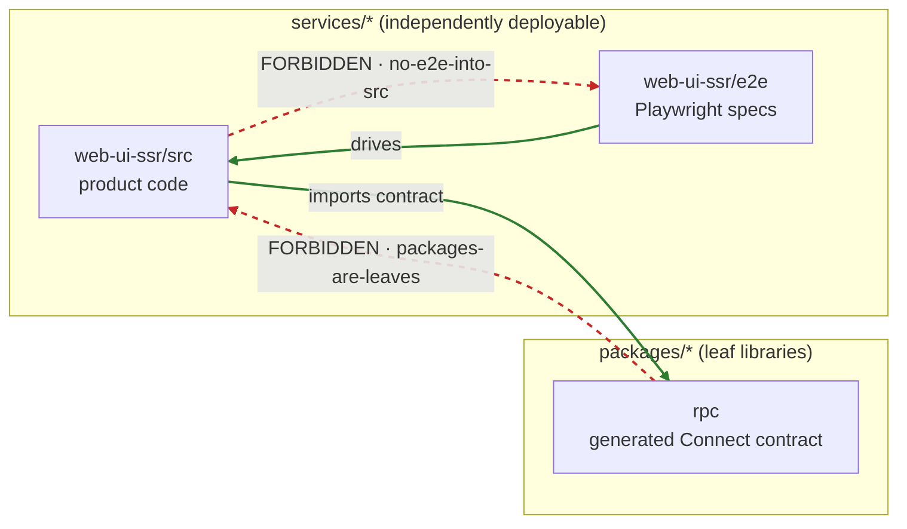

# Architecture boundaries: dependency-cruiser

[dependency-cruiser](https://github.com/sverweij/dependency-cruiser) enforces the
**allowed direction of imports** across the TypeScript workspace. It owns exactly
one axis — _which module may import which_ — and deliberately overlaps with nothing
else in the hygiene stack:

| Guardrail | Owns |
| --------- | ---- |
| **dependency-cruiser** (this doc) | import **direction** / module boundaries |
| syncpack / sherif | dependency-**version** consistency across workspaces |
| knip | **unused** files / exports / dependencies (dead code) |
| ast-grep (`rules/`) | structural code **patterns** (incl. _where_ a Connect transport may be built) |
| strict tsconfig / biome / eslint | type & style discipline |

Config lives at the repo root in [`.dependency-cruiser.cjs`](../.dependency-cruiser.cjs).

## Commands

```bash
bun run lint:boundaries    # depcruise — the CI gate (exit ≠ 0 on any violation)
```

Also runs inside the aggregate hygiene gate:

```bash
devenv tasks run ci:hygiene
```

Regenerate the full, detailed module graph **on demand** (no committed binary artifact —
the graph below is the hand-curated boundary map; the command emits the exhaustive one):

```bash
# Mermaid (paste into any Markdown viewer)
bun run lint:boundaries -- --output-type mermaid
# or an interactive HTML report (opens the whole dependency tree)
bunx depcruise services packages --config .dependency-cruiser.cjs \
  --output-type dot | dot -T svg > graph.svg   # needs graphviz (`dot`)
```

> graphviz (`dot`) is **not** in devenv; use the `mermaid` reporter, which needs no
> system dependency.

## Forbidden rules (each is a real boundary here)

| Rule | Boundary | Why it's real in this repo |
| ---- | -------- | -------------------------- |
| `no-circular` | No import cycle anywhere | Cycles make modules impossible to build/test/reason about in isolation. |
| `no-orphans` | No isolated module in first-party source | An orphan is dead code or a wiring mistake. By-convention entry points are exempted (see below). |
| `services-isolated` | A service must not import another service's source | `services/*` are independently deployable units; cross-service coupling belongs behind the RPC contract, not a source import. |
| `packages-are-leaves` | `packages/**` must not import `services/**` | `packages/rpc` is the shared generated Connect contract. A package importing a service would invert the dependency arrow (the contract depending on a consumer). |
| `no-e2e-into-src` | `src/` must not import from `e2e/` | Playwright specs/fixtures are test-only; leaking them into product `src/` drags test deps into the shipped bundle. |

### Rules considered and intentionally **not** added

- **"Only the two sanctioned modules build a Connect transport."** Already enforced by
  ast-grep (`rules/connect-transport-centralized.yml`): it bans `createConnectTransport()`
  calls outside `src/transport.ts` / `src/transport-client.ts`. That is a _call-site_
  constraint, which ast-grep expresses precisely; dependency-cruiser only sees
  import edges and would duplicate (and under-specify) it. **Not** re-encoded here.
- **"`src` must not import `styled-system` except via sanctioned entries."** Panda's
  `styled-system/` is generated and legitimately imported by every styled module via
  relative paths (`../../styled-system/css`). There is no sanctioned-entry convention to
  enforce, so no rule — `styled-system` is simply excluded from the cruise (generated).

## Exclusions & orphan exemptions

**Never analysed** (generated / vendored / build output — `options.doNotFollow` + `options.exclude`):
`node_modules`, `packages/rpc/gen`, `services/business-logic-java/generated-sources`,
`styled-system`, `dist`, `target`, and `routeTree.gen.ts`. These are all gitignored and
skipped by every other guardrail too.

**`no-orphans` exemptions** (files loaded by convention, not by a static import):

| Pattern | Why exempt |
| ------- | ---------- |
| `src/index.ts`, `src/entry-{server,client}.tsx` | Build / runtime entry points (loaded by the bundler / Bun). |
| `*.gen.ts` | Generated TanStack Router route tree, loaded by convention. |
| `/scripts/` | Standalone CLI scripts run via `bun run scripts/…` (never statically imported). |
| `*.{test,spec}.{ts,tsx}` | Test-runner entry points. |
| `*.config.{js,cjs,mjs,ts}` | Tool configs loaded by convention (postcss, rsbuild, panda, playwright). |
| `*.d.ts` | Ambient declaration files. |

## Boundary map

Hand-curated view of the sanctioned (solid) and forbidden (dashed red) directions.
Regenerate the exhaustive per-module graph with the command above.


